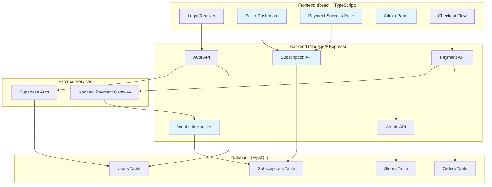

```mermaid
graph TB
    subgraph "Frontend (React + TypeScript)"
        A[Login/Register]
        B[Seller Dashboard]
        C[Payment Success Page]
        D[Admin Panel]
        E[Checkout Flow]
    end

    subgraph "Backend (Node.js + Express)"
        F[Auth API]
        G[Subscription API]
        H[Payment API]
        I[Admin API]
        J[Webhook Handler]
    end

    subgraph "Database (MySQL)"
        K[Users Table]
        L[Stores Table]
        M[Subscriptions Table]
        N[Orders Table]
    end

    subgraph "External Services"
        O[Konnect Payment Gateway]
        P[Supabase Auth]
    end

    A --> F
    B --> G
    C --> G
    D --> I
    E --> H

    F --> K
    G --> M
    H --> N
    I --> L

    H --> O
    O --> J
    J --> M

    F --> P
    P --> K

    style B fill:#e1f5fe
    style C fill:#e1f5fe
    style D fill:#e1f5fe
    style G fill:#e1f5fe
    style J fill:#e1f5fe
```