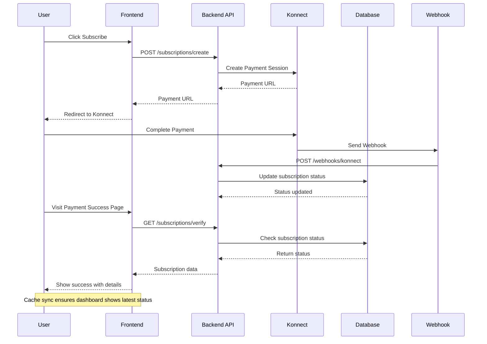

```mermaid
sequenceDiagram
    participant U as User
    participant F as Frontend
    participant B as Backend API
    participant K as Konnect
    participant DB as Database
    participant W as Webhook

    U->>F: Click Subscribe
    F->>B: POST /subscriptions/create
    B->>K: Create Payment Session
    K-->>B: Payment URL
    B-->>F: Payment URL
    F-->>U: Redirect to Konnect

    U->>K: Complete Payment
    K->>W: Send Webhook
    W->>B: POST /webhooks/konnect
    B->>DB: Update subscription status
    DB-->>B: Status updated

    U->>F: Visit Payment Success Page
    F->>B: GET /subscriptions/verify
    B->>DB: Check subscription status
    DB-->>B: Return status
    B-->>F: Subscription data
    F-->>U: Show success with details

    Note over F,U: Cache sync ensures dashboard shows latest status
```